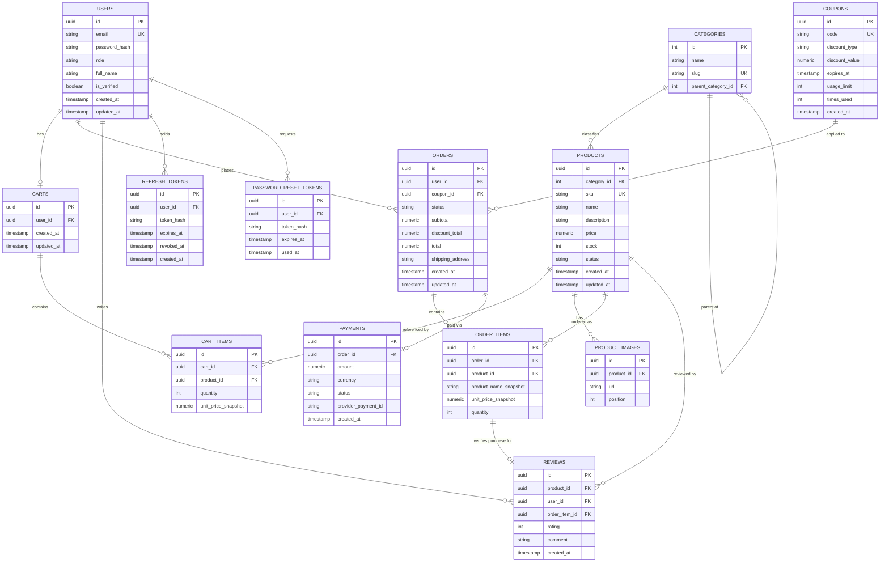

# E-Commerce API — Entity Relationship Diagram

Designed for PostgreSQL, targeting 3NF with two deliberate exceptions (order-line snapshots and a documented scope cut) noted below.

## Diagram

## Entity Descriptions

**users** — every account. A single table with a `role` column (`customer` / `admin`) rather than separate tables per role.

**categories** — self-referencing via `parent_category_id` for subcategories. Admin-managed and low-cardinality, so an integer PK is fine here even though most other tables use UUIDs.

**products** — the catalog. `sku` is unique and human-referenceable; `status` (`draft`/`published`/`archived`) controls what's visible in public browsing; `stock` is the authoritative count checked and decremented at order time.

**product_images** — one-to-many gallery per product, with `position` for display order.

**carts** — one active cart per user (1:1 via unique `user_id`). Persisted server-side rather than kept only in client state, so a user's cart survives across devices and sessions.

**cart_items** — line items in a cart. `unit_price_snapshot` is captured so the cart display doesn't silently shift if a price changes while items sit in the cart — though note the price used at actual checkout should still be re-validated against the live `products.price`, not trusted from the cart.

**orders** — the order header: status lifecycle, computed totals, and a reference to any coupon applied. `shipping_address` is a plain string field here — see the scope note below.

**order_items** — the order's line items, and the most important entity in this schema. See Design Decisions.

**payments** — one payment record per order (unique `order_id`). Kept separate from `orders` so retries, provider IDs, and payment-specific status don't pollute the order record itself.

**reviews** — tied to a specific `order_item_id`, not just to a user+product pair. See Design Decisions.

**coupons** — flat `discount_type` (`percentage`/`fixed`) and `discount_value`, with `usage_limit`/`times_used` enforced at application level when a coupon is applied.

**refresh_tokens** / **password_reset_tokens** — short-lived, revocable tokens kept out of `users` so a compromised token doesn't touch the core account record, and expired/used tokens can be purged independently.

## Relationship Summary

| From | To | Cardinality | Notes |
| --- | --- | --- | --- |
| users | carts | 1 : 0..1 | One active cart per user |
| carts | cart_items | 1 : N | — |
| products | cart_items | 1 : N | — |
| categories | products | 1 : N | — |
| categories | categories | 1 : N | Self-referencing, subcategories |
| products | product_images | 1 : N | — |
| users | orders | 1 : N | — |
| coupons | orders | 1 : N | Nullable FK, one coupon per order |
| orders | order_items | 1 : N | — |
| products | order_items | 1 : N | — |
| orders | payments | 1 : 0..1 | Unique FK |
| users | reviews | 1 : N | — |
| products | reviews | 1 : N | — |
| order_items | reviews | 1 : 0..1 | Unique FK — purchase verification |
| users | refresh_tokens | 1 : N | — |
| users | password_reset_tokens | 1 : N | — |

## Design Decisions Worth Understanding (Not Just Copying)

1. **`order_items` snapshots `product_name` and `unit_price` instead of joining to `products` for them.** If a product's price changes after purchase, past orders must still reflect what the customer actually paid. Joining live to `products` for historical order display is the most common e-commerce schema mistake beginners make.
2. **`reviews.order_item_id` is the purchase-verification mechanism, enforced by the database, not application logic.** A unique constraint on `order_item_id` guarantees one review per purchased item at the schema level — no buggy service code can violate it, unlike a looser "check if user has any completed order with this product" approach.
3. **`orders.coupon_id` is a single nullable FK, not a join table**, because this scope only supports one coupon per order. Supporting stackable coupons would require an `order_coupons` join table instead — a deliberate cut, worth naming as a "here's what I'd add next" in an interview.
4. **`shipping_address` is a plain field on `orders`, not its own `addresses` table.** A production system would have a reusable address book per user. Intentionally out of scope here to keep the project finishable — same kind of deliberate, explainable simplification as #3.

## Indexing Notes

- Unique indexes: `users(email)`, `products(sku)`, `categories(slug)`, `carts(user_id)`, `payments(order_id)`, `reviews(order_item_id)`, `coupons(code)`
- Frequent-lookup indexes: `products(category_id)`, `products(status)`, `orders(user_id)`, `orders(status)`, `order_items(order_id)`, `cart_items(cart_id)`
- Consider a partial index on `products(status)` restricted to `status = 'published'`, since that's the dominant read pattern (public browsing)